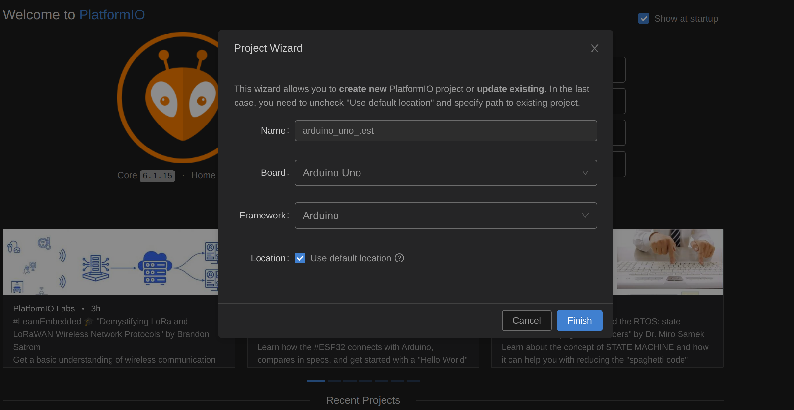
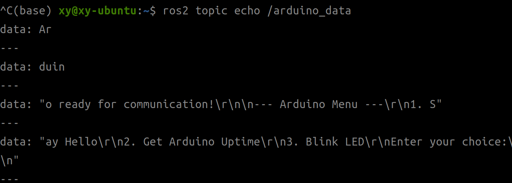
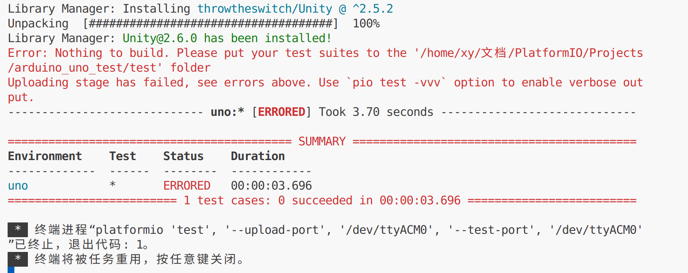

## 在 Ubuntu 环境下使用 VSCode 和 PlatformIO 下载程序到 Arduino Uno

1. 安装 VSCode

   - 访问 [VSCode 官网](https://code.visualstudio.com/) 下载 .deb 包
   - 使用以下命令安装：
     ```
     sudo dpkg -i <下载的文件名>.deb
     sudo apt-get install -f
     ```
2. 安装 PlatformIO 扩展

   - 在 VSCode 中，转到扩展市场（Ctrl+Shift+X）
   - 搜索 "PlatformIO IDE"
   - 点击 "安装"
3. 创建 PlatformIO 项目

   - 在 VSCode 中，点击 PlatformIO 图标（通常在左侧栏）
   - 选择 "New Project"
   - 选择 Board: "Arduino Uno"
   - 选择 Framework: "Arduino"
   - 选择项目位置并命名
     
4. 编写代码

   - 在 `src/main.cpp` 中编写或粘贴您的 Arduino 代码
     ```
     #include <Arduino.h>

     void printMenu() {
         Serial.println("\n--- Arduino Menu ---");
         Serial.println("1. Say Hello");
         Serial.println("2. Get Arduino Uptime");
         Serial.println("3. Blink LED");
         Serial.println("Enter your choice:");
     }

     void setup() {
         Serial.begin(9600);
         while (!Serial) {
             ; // Wait for serial port to connect (needed for native USB port only)
         }
         Serial.println("Arduino ready for communication!");
         pinMode(LED_BUILTIN, OUTPUT);
         printMenu();
     }

     void loop() {
         if (Serial.available() > 0) {
             char choice = Serial.read();

             // Clear the serial buffer
             while (Serial.available() > 0) {
                 Serial.read();
             }

             switch (choice) {
                 case '1':
                     Serial.println("Hello from Arduino!");
                     break;
                 case '2':
                     Serial.print("Arduino uptime: ");
                     Serial.print(millis() / 1000);
                     Serial.println(" seconds");
                     break;
                 case '3':
                     Serial.println("Blinking LED 3 times...");
                     for (int i = 0; i < 3; i++) {
                         digitalWrite(LED_BUILTIN, HIGH);
                         delay(500);
                         digitalWrite(LED_BUILTIN, LOW);
                         delay(500);
                     }
                     Serial.println("Blinking complete!");
                     break;
                 default:
                     Serial.println("Invalid choice. Please try again.");
             }

             printMenu();
         }
     }
     ```
5. 连接 Arduino Uno

   - 使用 USB 线将 Arduino Uno 连接到电脑
6. 编译和上传

   - 点击 VSCode 底部状态栏的 "PlatformIO: Build" 图标编译代码
   - 点击 "PlatformIO: Upload" 图标将程序上传到 Arduino Uno
7. 监视串口输出

   - 点击 "PlatformIO: Serial Monitor" 图标打开串口监视器
   - 这时在串口监视器中输入数字，就可以选择相应的功能。

   注：如果遇到权限问题，可能需要将用户添加到 `dialout` 组：

   ```
   sudo usermod -a -G dialout $USER
   ```

   添加后需要注销并重新登录才能生效。

# ROS 2 与 Arduino 通信指南

## 准备工作

1. 确保已安装 ROS 2（本指南基于 ROS 2 Humble）
2. 确保已安装 Arduino IDE 并能正常使用
3. 安装必要的 ROS 2 包：
   ```sh
   sudo apt install ros-humble-serial-driver
   ```

## Arduino 端设置

1. 打开 Arduino IDE，创建新项目
2. 将以下代码复制到 Arduino IDE 中：

```cpp:src/main.cpp
#include <Arduino.h>

void printMenu() {
  Serial.println("\n--- Arduino Menu ---");
  Serial.println("1. Say Hello");
  Serial.println("2. Get Arduino Uptime");
  Serial.println("3. Blink LED");
  Serial.println("Enter your choice:");
}

void setup() {
  Serial.begin(9600);
  while (!Serial) {
    ; // Wait for serial port to connect (needed for native USB port only)
  }
  delay(1000); // 添加一个短暂的延迟
  Serial.println("Arduino ready for communication!");
  pinMode(LED_BUILTIN, OUTPUT);
  printMenu();
}

void loop() {
  if (Serial.available() > 0) {
    char choice = Serial.read();
  
    // Clear the serial buffer
    while(Serial.available() > 0) {
      Serial.read();
    }
  
    switch(choice) {
      case '1':
        Serial.println("Hello from Arduino!");
        break;
      case '2':
        Serial.print("Arduino uptime: ");
        Serial.print(millis() / 1000);
        Serial.println(" seconds");
        break;
      case '3':
        Serial.println("Blinking LED 3 times...");
        for(int i = 0; i < 3; i++) {
          digitalWrite(LED_BUILTIN, HIGH);
          delay(500);
          digitalWrite(LED_BUILTIN, LOW);
          delay(500);
        }
        Serial.println("Blinking complete!");
        break;
      default:
        Serial.println("Invalid choice. Please try again.");
    }
  
    printMenu();
  }
}
```

3. 将代码上传到 Arduino

## ROS 2 端设置

1. 创建一个新的 ROS 2 包（如果还没有）：

   ```sh
   mkdir ros2_ws/src/arduino_communication
   cd ros2_ws/src/arduino_communication
   ros2 pkg create --build-type ament_cmake arduino_communication
   ```
2. 在 `arduino_communication` 包中创建 `src/arduino_serial_node.cpp` 文件，并添加以下代码：

```cpp:src/arduino_serial_node.cpp
#include <rclcpp/rclcpp.hpp>
#include <std_msgs/msg/string.hpp>
#include <serial_driver/serial_driver.hpp>
#include <vector>
#include <string>

using drivers::serial_driver::SerialDriver;
using drivers::serial_driver::SerialPortConfig;
using drivers::common::IoContext;

class ArduinoSerialNode : public rclcpp::Node {
public:
    ArduinoSerialNode()
        : Node("arduino_serial_node")
    {
        // 创建 IoContext
        io_context_ = std::make_shared<IoContext>(1);

        // 创建 SerialPortConfig
        auto device_config = std::make_shared<SerialPortConfig>(
            9600,
            drivers::serial_driver::FlowControl::NONE,
            drivers::serial_driver::Parity::NONE,
            drivers::serial_driver::StopBits::ONE
        );

        // 创建 SerialDriver
        serial_driver_ = std::make_unique<SerialDriver>(*io_context_);

        // 打开串口
        try {
            serial_driver_->init_port("/dev/ttyACM0", *device_config);
            serial_driver_->port()->open();
            RCLCPP_INFO(this->get_logger(), "Serial port opened successfully");
        } catch (const std::exception &ex) {
            RCLCPP_ERROR(this->get_logger(), "Error opening serial port: %s", ex.what());
            return;
        }

        // 创建定时器和发布者
        timer_ = this->create_wall_timer(
            std::chrono::milliseconds(100),
            std::bind(&ArduinoSerialNode::timer_callback, this));

        publisher_ = this->create_publisher<std_msgs::msg::String>("arduino_data", 10);
    }

private:
    void timer_callback() {
        std::vector<uint8_t> buffer(256);
        size_t bytes_read = 0;

        try {
            bytes_read = serial_driver_->port()->receive(buffer);
        } catch (const std::exception &ex) {
            RCLCPP_ERROR(this->get_logger(), "Error reading from serial port: %s", ex.what());
            return;
        }

        if (bytes_read > 0) {
            std::string data(buffer.begin(), buffer.begin() + bytes_read);
            process_and_publish_data(data);
        }
    }

    void process_and_publish_data(const std::string& data) {
        static std::string buffer;
        buffer += data;

        size_t pos;
        while ((pos = buffer.find('\n')) != std::string::npos) {
            std::string line = buffer.substr(0, pos);
            buffer.erase(0, pos + 1);

            if (line.find("Arduino ready for communication!") != std::string::npos ||
                line.find("Hello from Arduino!") != std::string::npos ||
                line.find("Arduino uptime:") != std::string::npos ||
                line.find("Blinking LED") != std::string::npos ||
                line.find("Blinking complete!") != std::string::npos ||
                line.find("Invalid choice") != std::string::npos) {
            
                auto message = std_msgs::msg::String();
                message.data = line;
                publisher_->publish(message);
                RCLCPP_INFO(this->get_logger(), "Published data: %s", line.c_str());
            }
        }
    }

    std::shared_ptr<IoContext> io_context_;
    std::unique_ptr<SerialDriver> serial_driver_;
    rclcpp::TimerBase::SharedPtr timer_;
    rclcpp::Publisher<std_msgs::msg::String>::SharedPtr publisher_;
};

int main(int argc, char *argv[]) {
    rclcpp::init(argc, argv);
    rclcpp::spin(std::make_shared<ArduinoSerialNode>());
    rclcpp::shutdown();
    return 0;
}


```

3. 修改 `CMakeLists.txt` 文件，添加以下内容：

```cmake:CMakeLists.txt
cmake_minimum_required(VERSION 3.5)
project(arduino_communication)

find_package(ament_cmake REQUIRED)
find_package(rclcpp REQUIRED)
find_package(std_msgs REQUIRED)
find_package(serial_driver REQUIRED)

add_executable(arduino_serial_node src/arduino_serial_node.cpp)
ament_target_dependencies(arduino_serial_node rclcpp std_msgs serial_driver)

install(TARGETS
  arduino_serial_node
  DESTINATION lib/${PROJECT_NAME})

ament_package()
```

4. 修改 `package.xml` 文件，添加以下依赖项：

```xml:package.xml
<package format="3">
  <name>arduino_communication</name>
  <version>0.0.0</version>
  <description>ROS 2 package for communicating with Arduino</description>
  <maintainer email="you@example.com">Your Name</maintainer>
  <license>Apache-2.0</license>

  <buildtool_depend>ament_cmake</buildtool_depend>
  <build_depend>rclcpp</build_depend>
  <build_depend>std_msgs</build_depend>
  <build_depend>serial_driver</build_depend>

  <exec_depend>rclcpp</exec_depend>
  <exec_depend>std_msgs</exec_depend>
  <exec_depend>serial_driver</exec_depend>

  <export>
    <build_type>ament_cmake</build_type>
  </export>
</package>
```

5. 构建并安装包：

```sh
cd ~/文档/PlatformIO/Projects/arduino_ros2_communicate/ros2_ws
colcon build --symlink-install
source install/setup.bash
```

6. 运行节点：

在运行节点之前，需要 `source` ROS 2 和工作空间的环境设置：

```sh
source /opt/ros/humble/setup.bash
source ~/文档/PlatformIO/Projects/arduino_ros2_communicate/ros2_ws/install/setup.bash
ros2 run arduino_communication arduino_serial_node
```

7. 在另一个终端中，查看从 Arduino 发布的数据：

```sh
source /opt/ros/humble/setup.bash
source ~/文档/PlatformIO/Projects/arduino_ros2_communicate/ros2_ws/install/setup.bash
ros2 topic echo /arduino_data
```

运行成功的话，可以看到 Arduino 发送的数据。


## 故障排除

### 串口监视器错误

如果在点击 "PlatformIO: Serial Monitor" 时出现类似以下的错误：


这是因为 PlatformIO 在尝试运行测试，但是找不到测试文件。解决方法如下：

1. 确保您不是在运行测试命令。串口监视器应该使用 "Monitor" 命令，而不是 "Test" 命令。
2. 如果问题仍然存在，尝试以下步骤：

   - 在项目根目录创建一个 `test` 文件夹（如果不存在）
   - 在 `test` 文件夹中创建一个空的测试文件，例如 `test_main.cpp`
   - 在 `test_main.cpp` 中添加以下内容：
     ```cpp
     #include <unity.h>

     void setUp(void) {
         // set stuff up here
     }

     void tearDown(void) {
         // clean stuff up here
     }

     void test_function_calculator_addition(void) {
         TEST_ASSERT_EQUAL(32, 25 + 7);
     }

     int main(int argc, char **argv) {
         UNITY_BEGIN();
         RUN_TEST(test_function_calculator_addition);
         UNITY_END();

         return 0;
     }
     ```
3. 检查 `platformio.ini` 文件，确保正确配置了串口监视器：

   ```ini
   [env:uno]
   platform = atmelavr
   board = uno
   framework = arduino
   monitor_speed = 9600
   ```

4.点击 “PlatformIO: Serial Monitor” 图标打开串口监视器
这时在串口监视器中输入数字，就可以选择相应的功能。

如果问题仍然存在，可以尝试重新安装 PlatformIO 或查看 PlatformIO 的官方文档以获取更多帮助。

### 串口设备错误

如果遇到 "Error opening serial port: open: No such file or directory" 错误，请尝试以下步骤：

1. 确保 Arduino 已正确连接到电脑。
2. 检查串口设备名称是否正确。使用以下命令列出可用的串口设备：

   ```sh
   ls /dev/tty*
   ```

   找到类似 `/dev/ttyACM0` 或 `/dev/ttyUSB0` 的设备名称，并在代码中更新。
3. 确保当前用户有权限访问串口设备。运行以下命令添加用户到 `dialout` 组：

   ```sh
   sudo usermod -a -G dialout $USER
   ```

   运行此命令后，注销并重新登录以使更改生效。
4. 如果问题仍然存在，尝试重新插拔 Arduino 或重启电脑。

### 重新编译和运行

1. 导航到工作空间目录：
   ```sh
   cd ~/文档/PlatformIO/Projects/arduino_ros2_communicate/ros2_ws
   ```

2. 清理之前的构建并重新编译包：
   ```sh
   colcon build --symlink-install --cmake-clean-cache
   ```

3. 如果上述命令失败，尝试只构建 arduino_communication 包：
   ```sh
   colcon build --symlink-install --packages-select arduino_communication
   ```

4. 重新加载环境：
   ```sh
   source /opt/ros/humble/setup.bash
   source ~/文档/PlatformIO/Projects/arduino_ros2_communicate/ros2_ws/install/setup.bash
   ```

5. 运行节点：
   ```sh
   ros2 run arduino_communication arduino_serial_node
   ```


通过以上步骤，你应该能够成功实现 ROS 2 与 Arduino 的通信。如果仍然遇到问题，请检查代码中的错误并确保所有依赖都已正确安装。


